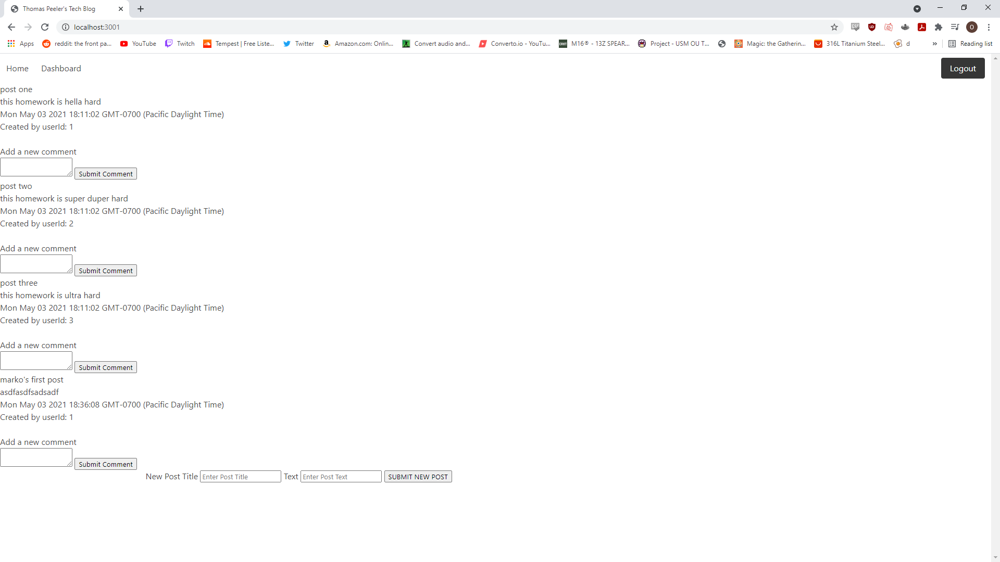

# Tech-BlogHW

The purpose of this assignment was to build a full stack application in which a database and server were established and interacted with a client side application to retrieve and store data from user input. The idea was to create a tech blog in which a user could login or sign up for an account to create posts, comment on posts, delete and edit their own posts, or view posts either from the home page or view strictly their own posts through the dashboard. 

## Getting Started
First I generated a new repo and began generating my starter files in MVC fashion. I started by creating my connection directory as well as basic directories for controllers, models, views, and a public folder for client side javascript. A utils directory was also useful for a handful of helper functions, namely the withAuth function that could be passed to route requests to verify whether a user was logged in or not. Then after making some basic requirements I installed all my dependencies after doing npm init to generate a basic package. I made sure to put all my connection variables into environmental variables that I could hide. I also added node modules to a git ignore so as not to attempt to push too many files to github at once.

### Prerequisites
Must install all dependencies, drop the database if it exists and intialize a new database. Also to make sure that the env file has the proper username, password, and database names. Then seeding the database was necessary for testing and some initial functionality. Then making sure that the server and database were communicating after starting the server and testing on the local port, and initializing any other requirements or dependencies that were used, mainly including npm packages for various tasks done throughout the application.

### Solving
Building an entire full stack application from scratch most certainly came with its challenges and I checked my notes almost as much as I built anything for this project. Many critical pieces to functionality were not fully operational but some of the groundwork or attempts were made to include as many technical aspects as possible. Creating the proper models and relationships proved incredibly difficult but also taught me a fair amount of how we can control the way models reference and pull from each other. The models all had very basic schema and seeds but sometimes getting the proper identification or verification per model and its respective usage was a challenge. After establishing the relationships and basic schema for the models I moved onto routing in which certain routes related to particular calls for model data via sequelize queries. These routes grabbed various data from the tables in MySQL and then passed that data around to various handlebars templates that served up HTML content for various routes. I never quite did get the comments to append underneath the posts or have posts route to their own pages but I did attempt to use partials to serve that HTML content underneath each comment either on the homepage or its respective dashboard to no avail. Another thing that I would have done given more time would have been to offer update and delete requests per post that were instantiated via client side javascript using more script files and routing requests but I ran out of time while working through other roadblocks up until this point. I wrote a handful of templates for handlebars to do various things and some of them worked together based on routes that rendered specific pages on their respective routes for the main landing page, logging in, navigating to the dashboard, and a comment partial file that never completely worked. The login functionality was done by offering dynamically acessible scripts to particular handlebars pages that were served up and rendered by particular routes and sessions would be initialized for the user that passed various email and password checks and then redirected to said pages. The register and login should both be entirely operational at the latest build and comments can also be accessed if directed to a particular set of routing however they never appended correctly to the partial page of which I attempted to call on them.

## Technologies Used

* [JavaScript](https://www.javascript.com/)
* [ExpressJS](https://expressjs.com/)
* [NodeJS](https://nodejs.org/en/)
* [MySQL](https://www.mysql.com/)
* [Insomnia](https://insomnia.rest/)
* [Bcrypt](https://www.npmjs.com/package/bcrypt)
* [Connect-Session-Sequelize](https://www.npmjs.com/package/connect-session-sequelize)
* [dotenv](https://www.npmjs.com/package/dotenv)
* [Express-Handlebars](https://www.npmjs.com/package/express-handlebars)
* [Express-Session](https://www.npmjs.com/package/express-session)
* [Sequelize](https://sequelize.org/)

## Screenshot 

;

## Authors
* **Thomas Peeler** 

## Deployed Link

- [https://tmpeelertechbloghw.herokuapp.com/]

## Github Repository
- [https://github.com/TMPeeler/Tech-BlogHW]